<!-- TODO: img 仔入 -->

# [Ten Years](https://ten-years-lilac.vercel.app)

<!-- TODO: text center -->

ＡTen Years is a matching website allows you to meet new people and chat with them.

</img>

- Test Account
  - Email: test01@test.com
  - Password: 000000

# Tech Stack

<!-- TODO: img/補上圖片 -->

## Front-end

- React
  - `useContext`, `React.memo`
- TypeScript
- Next.js
  - Router, Image
- Tailwind CSS

## Back-end

- Firebase
  - Authentication
  - Firestore Database
  - Storage
- Vercel

## Tools

- ESLint/Prettier
- Git

# Main Features

1. Sign up and fill in basic information

   - Your image will be automatically saved after upload.

   

2. Start Finding Your Match from "Today's Suggestions"!

   - After login each day, you'll be provided with today's potential matches. Click on the photo to view images, and the text area to view user profiles.
   - Depending on your quota of hearts, send likes to your favorite one !
   - Matchmaking logic: - candidates who are not friends - have not sent a friend request previously. -

   

3. Successful Matchmaking

   - Go to "Like You" to see if someone likes you!
   - Historical data is also available below for review.
   - A match is successful when the other person likes you back, and you can see the matched individuals in the Chat!

   

4. Instant Messaging

- Chat with the other person through text to get to know them better :)

  

<!-- TODO: improvemenets -->
<!-- 4.1 傳送圖片 -->
<!-- 5. **心理測驗** --
<!-- 1. 心理測驗可幫助你了自己、找到更適合的配對對象 -->
<!-- 1. **不再感興趣了嗎** --
<!-- 1. 可以在這裡取消配對，朝向下一段緣份邁進～ -->

# Database Schema

</img>

# Contact

- Name: Xiao-Jing Chen 陳筱靜
- Email: vera.xj.chen@gmail.com
- LinkedIn: [in/vera-xj-chen](https://www.linkedin.com/in/vera-xj-chen/)
